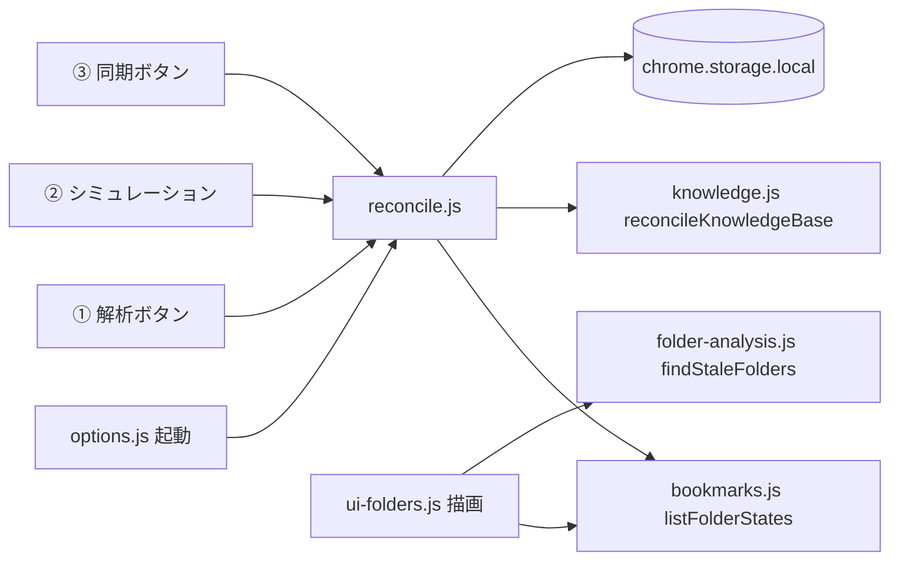
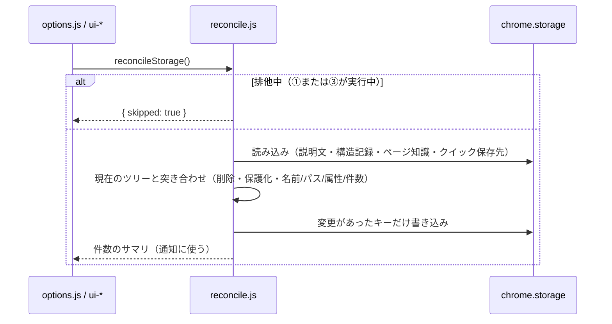

# Design Document: cache-consistency

## Overview
**Purpose**: ブックマークの削除・改名・移動を、保存データ（フォルダの説明文・フォルダ構造の記録・ページ知識・クイック保存先）と画面表示に食い違いとして残さない。
**Users**: ブックマークを日常的に整理する利用者。設定画面を開く、または ①②③ を実行する際に、AI を呼ばずに整合が取られる。
**Impact**: 現在は「①の全フォルダ解析（課金）」と「③の同期ボタン」でしか整理されない保存データを、画面表示時と各実行前に、AI 不要で整える。あわせて ① の一覧を現在のツリーを基準に描画し、再解析の要否判定に「名称変更」「場所の変更」を加える。

### Goals
- 一覧・案内が常に現在のブックマークと一致する（Requirement 1, 3）。
- 整合処理は無料・冪等・利用者のデータを壊さない（Requirement 2, 4）。

### Non-Goals
- ブックマーク変更イベントを契機とした即時整理（設定画面を開くまで反映されない）。
- 改名・移動を理由とした説明文の自動再生成。
- 保存データの統合・再設計（`Note.md` §6.1 の根本対応 C として別途）。

## Boundary Commitments

### This Spec Owns
- 整合処理（`reconcile.js`）と、その結果の通知。
- フォルダ構造の記録（`folder_meta_tree`）の `analyzed_name` / `analyzed_path` の追加と、その意味（説明文を生成した時点の名前・階層パス）。
- 再解析の要否判定（`findStaleFolders`）の理由の拡張。

### Out of Boundary
- 自動振り分けが、再解析までの間に旧説明文を使い続けること（既知の制限）。
- キーワードの形式（`knowledge-keywords` が扱う）。ページ知識のうちキーワード以外の項目の内容。

### Allowed Dependencies
- `bookmarks.js`（ツリー走査）、`storage.js`（キー定義・読み出し）、`knowledge.js`（ページ知識の更新）。上位層（`ui-*`）から `reconcile.js` を呼ぶ一方向にする。

### Revalidation Triggers
- `folder_meta_tree` / `folder_descriptions_by_id` / `page_knowledge_base` / `quick_folders` の形やキーの変更。
- 整合処理を呼ぶ契機（画面表示時・各実行前）の変更。

## Architecture

### Existing Architecture Analysis
- 説明文はフォルダ ID をキーにした辞書、フォルダ構造の記録は配列で、①の全解析でのみ全置換される。③のページ知識は同期ボタンでのみ整理される（`applyLocalKbUpdates`）。
- ① の一覧は保存済みの記録（`folder_meta_tree`）をそのまま描画している（現在のツリーを見ていない）。
- `extractFolders` は「直下にブックマークを持つ非システムフォルダ」だけを返す。説明文はそれ以外の（空の）フォルダにも保存されうるが、候補の組み立て（`buildFolderCandidates`）は全フォルダを対象にする。

### Architecture Pattern & Boundary Map

- 選択パターン: 「読み込み時と実行前に、決定的な整合関数を1回呼ぶ」。イベント駆動は競合の設計が重いため採らない。
- 維持するパターン: DOM に触れる処理は `ui-*` のみ／共有ロジックは DOM 非依存／AI を呼ばない処理を AI タスクと分ける。

### Technology Stack
| Layer | Choice | Role | Notes |
|---|---|---|---|
| Runtime | Chrome MV3 / ES modules | 既存のまま | 新規ライブラリなし |
| Data | `chrome.storage.local` | 既存キーの更新のみ | `storage_version` は据え置き（新フィールドは遅延付与） |

## File Structure Plan
### Directory Structure
```
reconcile.js       # 整合処理本体（DOM非依存）と、実行中は整合を始めないための排他
ui-reconcile.js    # 整合の呼び出し・結果通知の表示（DOM）
```
### Modified Files
- `bookmarks.js` — `listFolderStates(tree)` を追加（全フォルダの現在の名前・パス・属性・直下の件数）。
- `knowledge.js` — `reconcileKnowledgeBase(bookmarks)`（削除済み除去・パス更新。編集済みキーワード等は保持）。
- `folder-analysis.js` — `findStaleFolders` に「名称変更」「場所の変更」を追加。`analyzeFolders` が `analyzed_name` / `analyzed_path` を保存。
- `ui-folders.js` — 一覧を現在のツリー基準で描画。案内文に理由別の件数。実行前に整合、実行中は排他。
- `ui-knowledge.js` / `ui-relocate.js` — 実行前に整合。③は実行中に排他。
- `options.js` / `options.html` — 起動時に整合を実行し、結果の通知欄（`#reconcile-status`）を表示。

## System Flows

- 変更が無ければ書き込まない（冪等・不要な書き込みを避ける）。失敗しても例外を UI に伝播させず、`{ error }` を返して表示・実行を続ける。

## Requirements Traceability
| Requirement | Summary | Components | Flows |
|---|---|---|---|
| 1.1–1.5 | 一覧を現在のツリー基準で描画 | ui-folders.js, bookmarks.listFolderStates | 描画時にツリーと結合 |
| 2.1, 2.2 | 画面表示時・実行前に整合 | options.js, ui-folders/knowledge/relocate | reconcileStorage |
| 2.3–2.7 | 削除・保護化・最新化・ページ知識・クイック保存先 | reconcile.js, knowledge.reconcileKnowledgeBase | 上記フロー |
| 2.8, 2.10 | 件数通知・失敗時の継続 | ui-reconcile.js | `{summary}` / `{error}` |
| 2.9 | 実行中は開始しない | reconcile.js（排他） | `{skipped}` |
| 2.11, 4.1–4.4 | 冪等・AI 非使用・保全 | reconcile.js | 変更時のみ書き込み |
| 3.1–3.6 | 名称変更・場所の変更の検出・案内 | folder-analysis.findStaleFolders, ui-folders.js | 理由の優先順位 |

## Components and Interfaces
### reconcile.js
| Field | Detail |
|---|---|
| Intent | 保存データを現在のブックマークへ、AI なしで整合させる |
| Requirements | 2.1–2.11, 4.1–4.4 |

```javascript
/** @returns {Promise<ReconcileResult>} */
export async function reconcileStorage()
/** @typedef {{skipped: true} | {error: Error} | {removedFolders: number, refreshedFolders: number, removedKnowledge: number, updatedKnowledge: number, removedQuickFolders: number}} ReconcileResult */
export const operationLock = { enter(name), leave(name), isBusy() }
export function describeReconcile(result) // 通知文（変更が無ければ空文字）
```
- 処理: (1) 説明文 = 現在存在し保護されていないフォルダの分だけ残す。(2) 構造記録 = 現在存在するフォルダのみ。名前・パス・属性・件数を現在値へ更新。`analyzed_name` / `analyzed_path` が無ければ、更新前の `folder_name` / `hierarchical_categories` を入れる（旧データの誤検知防止）。(3) ページ知識 = 削除済み除去、パス更新（キーワード等は触らない）。(4) クイック保存先 = 存在しない ID を除去。
- 不変条件: ブックマークを一切変更しない／AI を呼ばない／変更が無ければ何も書かない。

### findStaleFolders（拡張）
理由は 1 フォルダに 1 つで、優先順位は「未解析 > 名称変更 > 場所の変更 > 件数変化（既存の理由名 `変更`）」。名前・パスの比較は `analyzed_name ?? folder_name`、`analyzed_path ?? hierarchical_categories`（旧データ）と現在値で行う。名称が同じで階層パスだけ違う場合を「場所の変更」とする（親の改名による子のパス変化も、この理由になる）。

## Data Models
`folder_meta_tree` の各要素に、次を**追加**する（既存フィールドはそのまま）。
| Field | Meaning |
|---|---|
| `analyzed_name` | 説明文を生成した時点のフォルダ名 |
| `analyzed_path` | 説明文を生成した時点の階層パス |
`folder_name` / `hierarchical_categories` / `is_*` / `entry_count` は「現在値のキャッシュ」で、整合のたびに更新される。将来の統合案（`folder_cache`）では、現在値は保存せず導出し、`analyzed_*` のみを持つ（`Note.md` §6.1）。

## Error Handling
- 整合の失敗（ストレージの読み書き・ツリー取得）は `{error}` として返し、`#reconcile-status` に警告を表示する。画面の描画と ①②③ の実行は続行する（2.10）。
- 排他中は `{skipped:true}`。通知は出さない。

## Testing Strategy
- Unit（reconcile）: 削除フォルダの説明文・記録が消える／保護化で説明文が消え記録は残る／改名・移動で記録が更新され `analyzed_*` は据え置き／旧データで `analyzed_*` が補完される／二度目は変更なし（冪等）／ページ知識のキーワード編集が保持される／クイック保存先から削除済み ID が消える。
- Unit（findStaleFolders）: 名称変更・場所の変更・優先順位・旧データで誤検知しない。
- Integration（設定画面）: 削除・改名後の一覧の表示（名前・パス・総数）、案内文の理由別件数、通知欄の件数、①②③ 実行前に整合が走る、排他中は走らない。
- 手動確認（実 Chrome）: 実際のブックマーク操作後に設定画面を開いて表示を確認。

## Migration Strategy
新フィールドは初回の整合処理で遅延付与するため、`storage_version` の引き上げは不要。
