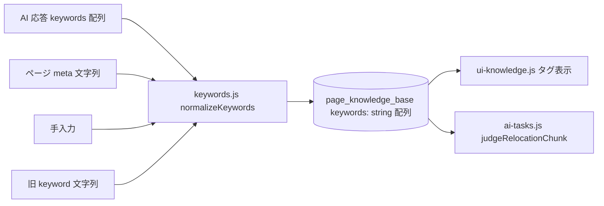

# Design Document: knowledge-keywords

## Overview
**Purpose**: ページ知識のキーワードを「1 語 = 1 タグ」として、入力元によらず一貫して保存・表示・編集する。
**Users**: ③ ナレッジ一覧でタグを見て編集する利用者と、キーワードを判断材料に使う ② 再カテゴライズ。
**Impact**: キーワードを区切り文字付きの 1 本の文字列（`keyword`）から、語の配列（`keywords: string[]`）へ変える。AI のスキーマも文字列の配列にし、右クリック時のページ meta・手入力・既存データは同じ正規化を通す。

### Goals
- どの入力元でも、キーワードは空白・区切りを含まない語の配列として保存される（Requirement 1–4）。
- 既存データは 1 回だけ、欠落なしで変換される（Requirement 5）。②へ渡す内容は変わらない（Requirement 6）。

### Non-Goals
- 検索・絞り込み、複合語（空白を含む語）の保持。キーワード以外の項目の変更。

## Boundary Commitments

### This Spec Owns
- 語への正規化ルール（`normalizeKeywords`）と、保存形式 `keywords: string[]`。
- 既存データの変換（`storage_version` 3）。AI に求めるキーワードの書式（プロンプトとスキーマ）。

### Out of Boundary
- ③ 同期の実行タイミング・課金。フォルダ関連の保存データ（`cache-consistency`）。

### Allowed Dependencies
- `keywords.js` は他のどのモジュールにも依存しない葉。`storage.js` / `knowledge.js` / `ai-tasks.js` / `ui-knowledge.js` が参照する。

### Revalidation Triggers
- 区切り文字の集合の変更、`keywords` の型の変更、AI スキーマの `keywords` の変更。

## Architecture

### Existing Architecture Analysis
- キーワードは文字列 `keyword` で、AI（`fetchKnowledgeBatch`）は文字列をそのまま、右クリック（`recordPageMetaKnowledge`）はページの meta を無加工で保存する。画面（`ui-knowledge.js`）だけが `split(",")` で分割する（書式の契約が無く、読み手だけが前提を持つ）。
- ② は `ai_knowledge_context.keyword` として文字列を AI に渡している。

### Architecture Pattern & Boundary Map

- 選択パターン: 書き込み時に必ず正規化（境界で型を確定）し、読み取りは配列を前提にする。移行が未完了の旧データにも耐えるよう、読み取り側は `getKeywords(entry)` で旧形式も正規化して読む。

## File Structure Plan
### Directory Structure
```
keywords.js   # normalizeKeywords / getKeywords（DOM・chrome 非依存の純粋関数）
```
### Modified Files
- `ai-tasks.js` — スキーマの `keyword: STRING` を `keywords: ARRAY<STRING>` に。プロンプトに書式を明記。応答は正規化して保存。②の `ai_knowledge_context` は `keywords` を渡す。
- `knowledge.js` — `recordPageMetaKnowledge` が ページ meta を正規化して `keywords` に保存。
- `storage.js` — `STORAGE_VERSION` を 3 に。`migrateLegacyStorage` に `keyword` → `keywords` の変換を追加。データ一覧のコメントを更新。
- `ui-knowledge.js` — タグの表示・追加・削除を配列で扱う。追加入力は正規化して複数タグに分ける。

## Requirements Traceability
| Requirement | Summary | Components |
|---|---|---|
| 1.1–1.6 | 語ごとのタグ・区切り・重複・空・`_` `-` を保持 | keywords.normalizeKeywords, ui-knowledge.js |
| 2.1–2.3 | AI の出力に適用・書式指示 | ai-tasks.fetchKnowledgeBatch（スキーマ・プロンプト） |
| 3.1–3.2 | ページ meta に適用 | knowledge.recordPageMetaKnowledge |
| 4.1–4.4 | 手入力の追加・削除・保持 | ui-knowledge.js |
| 5.1–5.6 | 既存データの変換 | storage.migrateLegacyStorage |
| 6.1–6.2 | ② への引き渡し | ai-tasks.judgeRelocationChunk |

## Components and Interfaces
### keywords.js
```javascript
/** 文字列または文字列の配列を、語の配列にする（区切りで分割・空を除く・大文字小文字を無視して重複を除く。最初の綴りを残す） */
export function normalizeKeywords(input: string | string[] | null | undefined): string[]
/** ページ知識の項目から語の配列を読む。keywords があればそれを、無ければ旧 keyword を正規化して返す */
export function getKeywords(entry: {keywords?: string[], keyword?: string}): string[]
```
- 区切り: 半角・全角のカンマ、読点（、）、セミコロン（; ；）、スラッシュ（/ ／）、縦線（| ｜）、改行、タブ、半角・全角の空白。`_` `-` と大文字小文字の並びは区切りにしない。
- 配列入力: 各要素を同じ規則で分割する（AI が要素内に区切りを含めても 1 語ずつになる）。

### AI への指示（ai-tasks.js）
プロンプトに次を追加する。「`keywords` は、空白や区切り文字を含まない 1 語ずつの配列で返してください。複数語の概念は `machine_learning` または `MachineLearning` のように 1 語にまとめてください（例: ["React","JavaScript","machine_learning"]）」。スキーマは `keywords: {type: ARRAY, items: {type: STRING}}` で、必須項目にする。

### 移行（storage.js）
`storage_version` が 3 未満のとき、全ページ知識で `keywords` が無ければ `normalizeKeywords(keyword)` を `keywords` に入れ、`keyword` を削除する。ほかの項目は変更しない。変換の途中で例外が出たら何も書かずに警告を記録し、バージョンを上げない（次回起動で再試行）。2 回目以降は対象がなく何もしない。

## Data Models
`page_knowledge_base[url]`: `{ subject, summary, description, keywords: string[], hierarchical_categories, last_updated_at, source }`（旧: `keyword: string`）。

## Error Handling
- 移行失敗: データを変更せず警告を記録（5.6）。読み取りは `getKeywords` が旧形式にも耐えるので、表示は継続する。
- 入力が想定外の型（null 等）: 空配列にする（例外を出さない）。

## Testing Strategy
- Unit: `normalizeKeywords` — カンマ・読点・空白・改行・`;` `/` `|`・全角、`_` `-` の保持、CamelCase の保持、重複（大文字小文字）、空・区切りのみ、配列入力（要素内の区切り）。`getKeywords` の旧形式読み取り。
- Unit（移行）: 旧 `keyword` の各形式が語の配列になる／他の項目は不変／冪等／途中で失敗したら不変。
- Integration: ③ 同期（AI が配列を返す・要素内に空白を含む場合）、右クリック保存（空白・読点区切りの meta）、ナレッジ一覧のタグ表示・追加（複数語の貼り付け）・削除、② に `keywords` が渡る、AI へのリクエストのスキーマとプロンプトに書式指示が含まれる。

## Migration Strategy
`storage_version` 2 → 3。`options.js` と `background.js` の起動時（既存の `migrateLegacyStorage()` 呼び出し）で、利用者の操作なしに実行される。
