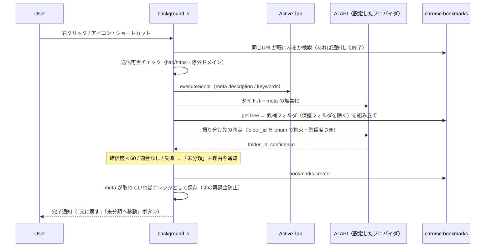
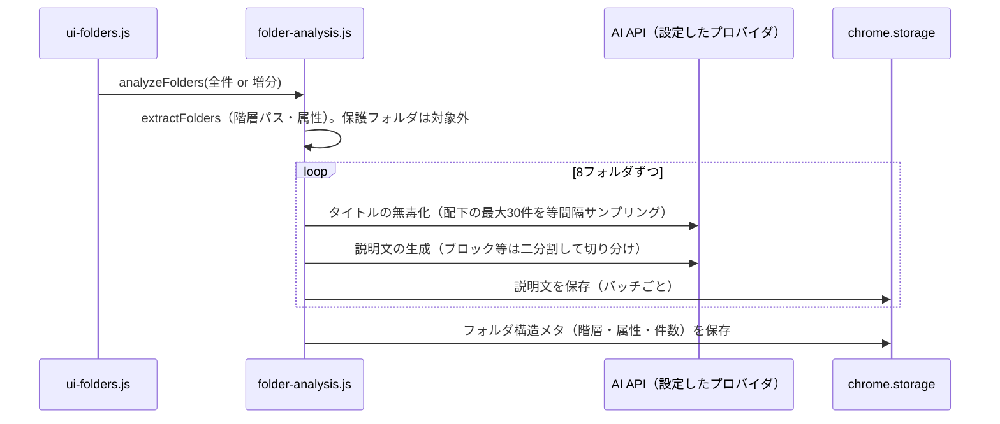
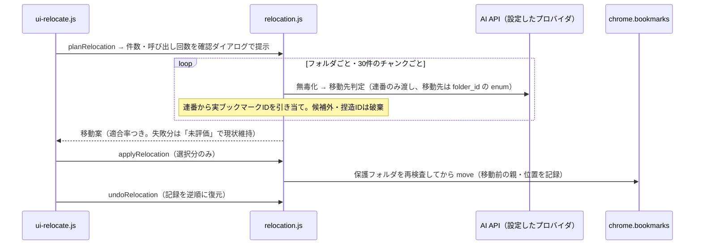

# ブックマーク整理 by Gemini（開発者向けドキュメント）

AI を使って、ブラウザのブックマークを最適なフォルダへ自動で振り分ける Chrome 拡張機能（Manifest V3）です。既定では Gemini API を直接呼びますが、設定画面でプロバイダを切り替えると、LiteLLM Proxy など任意の OpenAI 互換エンドポイント（自前ホストのものを含む）を使うこともできます（§6.1）。

| ドキュメント | 対象 | 内容 |
|---|---|---|
| このファイル | 開発者 | 構成・データモデル・権限・プライバシー・フォールバック・制限事項 |
| [user_guide.html](user_guide.html) | エンドユーザー | インストール・使い方・費用・トラブルシューティング（設定画面の右上からも開けます） |
| [Note.md](Note.md) | 開発者 | 開発の経緯、遭遇した問題と対応、未解決の課題 |

関数の仕様（引数・戻り値・例外）は、各ソースの JSDoc を正としています。このファイルには概要と設計上の判断だけを書きます。

## 1. 何ができるか

| 機能 | 起点 | 概要 |
|---|---|---|
| 自動振り分け保存 | 右クリック「最適カテゴリへ追加」／ツールバーアイコン／ショートカット（既定 `Alt+Shift+B`） | 開いているページを、AI が選んだフォルダへブックマークする。判定できなければ「未分類」に入れ、理由を通知する |
| クイック保存 | 右クリックメニュー | 設定画面で選んだフォルダ（最大5件）と「未分類」へ、AI を使わず保存する |
| 保存の取り消し | 保存完了の通知ボタン | 「元に戻す」（削除）／「未分類」へ移動 |
| ① フォルダ解析 | 設定画面 | フォルダごとの説明文（Description）を AI で生成して保存する。これが自動振り分けの判断材料になる |
| ② 再カテゴライズ | 設定画面 | 既存の全ブックマークの最適な配置を AI に判定させ、差分をプレビューして適用する。直前の1回分は取り消せる |
| ③ ナレッジ同期 | 設定画面 | URL とタイトルから AI が推定した「テーマ・要約・キーワード」を蓄積する（再カテゴライズの判断材料） |
| ④ 動作ログ | 設定画面 | AI API 呼び出しの履歴（成否・ブロック理由・リトライ・トークン数・使用したプロバイダ）と累計トークンを表示する |

`[` と `]` で囲んだ名前のフォルダ（例: `[仕事用]`）とその配下は「保護フォルダ」として扱い、AI による移動・送信の対象外にします（§7）。

## 2. ファイル構成

```
manifest.json        拡張機能の定義（権限・ショートカット・サービスワーカー）
background.js        サービスワーカー。メニュー構築と、ブックマーク登録の一連の処理・通知
options.html/.css    設定画面
options.js           設定画面のエントリ（初期化のみ）
icon.png             アイコン
tests/                自動テスト（詳細は tests/README.md）
```

共有モジュール（DOM に依存しない）:

| ファイル | 責務 |
|---|---|
| `config.js` | 調整用の定数（バッチ件数・閾値・上限など）を集約 |
| `gemini.js` | AI 呼び出しの共通オーケストレーション `callGemini`。リトライ、ブロック理由の検査、動作ログの記録、二分割リトライ `processWithBisect`、プロバイダの切替（`PROVIDERS`）。Gemini 本体向けのリクエスト組み立てもここに持つ |
| `openai-compatible.js` | OpenAI 互換エンドポイント（LiteLLM Proxy 等）向けのアダプター。`gemini.js` から呼ばれる。スキーマの方言変換もここ |
| `ai-tasks.js` | AI に依頼する各タスクのプロンプト・応答スキーマ・応答の検証 |
| `bookmarks.js` | ブックマークツリーの走査、階層パス、保護フォルダの判定、候補フォルダの組み立て |
| `storage.js` | `chrome.storage.local` のキー定義と、旧形式からの移行 |
| `privacy.js` | AI へ送る URL の制限（http/https のみ・除外ドメイン・クエリ除去） |
| `folder-analysis.js` | ① フォルダ解析（バッチ処理・増分保存・再解析が必要なフォルダの検出） |
| `relocation.js` | ② 再カテゴライズの計画・シミュレーション・適用・取り消し |
| `knowledge.js` | ③ ナレッジ同期の計画・実行、ページ meta の保存 |

設定画面の画面処理:

| ファイル | 担当 |
|---|---|
| `ui-common.js` | DOM 構築ヘルパー `h()`、状態表示、記号 |
| `ui-settings.js` | API キー・接続テスト・プライバシー設定・クイック保存先 |
| `ui-folders.js` | ① |
| `ui-relocate.js` / `ui-diff.js` | ② / 差分の描画（Unified・Split） |
| `ui-knowledge.js` | ③ |
| `ui-log.js` | ④ |

依存の向き: `ui-*` → 各ワークフロー（`folder-analysis` / `relocation` / `knowledge`）→ `ai-tasks` → `gemini`。`background.js` も同じ層を使います。

## 3. インストールとデバッグ

1. `chrome://extensions/` を開き、右上の「デベロッパー モード」を ON にする。
2. 「パッケージ化されていない拡張機能を読み込む」で、このフォルダを選ぶ。
3. 初回インストール時に設定画面が開く。API キーを保存して「接続テスト」で疎通を確認する。

デバッグ:

| 対象 | 見方 |
|---|---|
| サービスワーカー（右クリック等の処理） | `chrome://extensions/` の拡張機能カードの「Service Worker」リンクからコンソールを開く |
| 設定画面 | 設定画面で F12 |
| API 呼び出しの成否・ブロック理由・トークン | 設定画面の「④ 動作ログ」 |
| ストレージの中身 | 上記コンソールで `chrome.storage.local.get(null)` |

コード変更後は、拡張機能カードの更新ボタンで再読み込みする（サービスワーカーは ES モジュールとして読み込まれる）。

## 4. 処理シーケンス

### 4.1 自動振り分け保存



`activeTab` はユーザー操作（メニュー・アイコン・ショートカット）で付与されるため、`<all_urls>` は不要です。ページの内容を読めない場合（ブラウザ内部ページ等）は、タイトルと URL だけで判定します。

### 4.2 ① フォルダ解析



### 4.3 ② 再カテゴライズ



## 5. データモデル（`chrome.storage.local`）

定義は `storage.js` の冒頭コメントが正です。

| キー | 型 | 内容 |
|---|---|---|
| `gemini_key` | string | API キー。名前は歴史的なもので、現在はプロバイダ共通の欄。**暗号化されず、この端末のブラウザ内に平文で保存される** |
| `llm_provider` | string | `"gemini"`（既定）／`"openai_compatible"`（LiteLLM Proxy 等）。§6.1 |
| `llm_base_url` | string | `openai_compatible` のときだけ使うエンドポイントのベース URL |
| `llm_model` | string | モデル名。Gemini は空なら `GEMINI_MODEL` の既定値を使う。`openai_compatible` では必須 |
| `privacy_settings` | `{ strip_query: boolean, excluded_domains: string[] }` | AI へ送る URL の制限 |
| `quick_folders` | string[] | 右クリックメニューに載せるフォルダの ID |
| `folder_descriptions_by_id` | `{ フォルダID: 説明文 }` | ① の結果。**フォルダ名ではなく ID をキーにする**（同名フォルダを区別するため） |
| `folder_meta_tree` | object[] | `{ folder_id, folder_name, hierarchical_categories, is_quick_access, is_untouchable, entry_count, analyzed_entry_count }`。`analyzed_entry_count` は説明文を生成した時点の件数で、再解析が必要かの判定に使う |
| `page_knowledge_base` | `{ URL: {...} }` | ③ のナレッジ。`{ subject, summary, description, keyword, hierarchical_categories, last_updated_at, source }`。`source` は `ai_estimate`（URL とタイトルからの AI 推定）または `page_meta`（右クリック時に読み取った実際の meta タグ） |
| `relocation_undo` | `{ applied_at, moves: [...] }` | 直前の一括適用の取り消し用記録（移動前の親フォルダ・位置） |
| `gemini_log` / `gemini_usage` | 配列 / object | 動作ログ（直近50件、使用したプロバイダを含む）と累計トークン。`gemini.js` が管理 |
| `storage_version` | number | データ形式の版数（現在 2） |

補足:

- **階層パスの区切りは ` › `**（例: `開発 › Node.js`）。`.` 区切りでは「Node.js」というフォルダ名と区別できないため。ブラケット `[ ]` はパスから除去する。
- `chrome.storage.session` に、通知の「元に戻す」用の直近の保存（`recent_actions`）を置く（ブラウザ終了で消える）。
- 旧形式（`folder_descriptions`: フォルダ名キー）は、起動時に `migrateLegacyStorage()` が ID キーへ移行する。同名フォルダなど対応が決まらないものは移行せず、次回の ① で再生成される。
- `is_quick_access` は「ブックマークバー配下のフォルダ」を表し、AI に「日常的に使う重要なフォルダ。適合度が同程度なら優先」と伝えている。

## 6. 権限とその理由

| 権限 | 理由 |
|---|---|
| `bookmarks` | ツリーの読み取り、ブックマークの作成・移動・削除 |
| `contextMenus` | 右クリックメニュー |
| `notifications` | 進捗・結果の通知（`update` で更新、ボタン付き） |
| `storage` | 設定・解析結果・ナレッジ・ログの保存 |
| `scripting` | 右クリック時に、開いているページの meta タグを読み取る |
| `activeTab` | 上記の読み取りと、タブのタイトル・URL の取得。**メニュー・アイコン・ショートカットの操作を行ったタブにだけ一時的に付与される** |
| host: `generativelanguage.googleapis.com` | Gemini API の呼び出し（`host_permissions`。常時付与） |
| optional host: `http://*/*`・`https://*/*` | OpenAI 互換エンドポイントの呼び出し用（`optional_host_permissions`）。実際に許可されるのは、ユーザーが設定画面で入力した1オリジンだけ（§6.1） |

`tabs` と `<all_urls>` は使いません。ショートカットは `chrome.tabs.query`（権限不要）で現在のタブを取得します。

## 6.1 AI プロバイダの切り替え

設定画面の「AI プロバイダ」で、次のどちらかを選べます。

| プロバイダ | 実際に呼ぶ先 | 認証 | モデル名 |
|---|---|---|---|
| `gemini`（既定） | `https://generativelanguage.googleapis.com/v1beta/models/<model>:generateContent` | ヘッダ `x-goog-api-key` | 空欄なら `GEMINI_MODEL`（`gemini-3.6-flash`） |
| `openai_compatible` | 設定した `<baseUrl>/chat/completions`（LiteLLM Proxy、その他 OpenAI 互換サーバー） | ヘッダ `Authorization: Bearer <key>` | 必須（LiteLLM 側のモデルエイリアス等） |

実装は `gemini.js` の `callGemini()` が、`connection.provider` に応じてプロバイダアダプター（Gemini 本体は `gemini.js` 内、OpenAI 互換は `openai-compatible.js`）へ委譲する形になっています。呼び出し側（`ai-tasks.js` 以降すべて）はどちらが選ばれているかを意識しません。プロンプトは共通、スキーマは `ai-tasks.js` に「Gemini 方言」（大文字の `type`、`response_schema`）で1種類だけ書き、`openai-compatible.js` が OpenAI の Structured Outputs（`response_format: {type:"json_schema", strict:true}`）形式へ自動変換します。

`openai_compatible` を保存するとき、入力したエンドポイントの**オリジンだけ**を `chrome.permissions.request()` で動的に許可を求めます（`manifest.json` には広い `optional_host_permissions` を宣言していますが、実際に許可されるのはユーザーが入力した1件だけです）。拒否された場合は保存されません。

制約:

- OpenAI 互換側の `finish_reason` は `stop`/`length`/`content_filter` 程度の粒度しかなく、Gemini の `promptFeedback.blockReason` ほど詳細ではありません。
- Structured Outputs（JSON Schema での出力強制）の対応度はバックエンドによって差があります。強制が効かない場合でも、アプリ側は返ってきた `folder_id` 等を必ず候補と照合してから使うため（A4 の対応）、想定外の値は「候補にない」として安全側に倒れます。
- トークン数（`usage.prompt_tokens` 等）を返さないプロキシでは、動作ログのトークン欄が空欄になります。

## 7. プライバシーモデル

ブックマークのデータは、判定のために **設定したAIプロバイダへ送信されます**（既定は Google の Gemini API。中継サーバーは使いません。LiteLLM Proxy 等を自前ホストすれば、外部へは一切出ない構成にもできます）。

| 機能 | 送信する内容 | 送信しない内容 |
|---|---|---|
| 自動振り分け保存 | ページのタイトル、meta の description/keywords（取れなければ URL）、URL、候補フォルダの ID・名前・階層パス・説明文 | 保護フォルダの情報、他のブックマーク |
| ① フォルダ解析 | フォルダ名・階層パス・属性・件数、配下ブックマークのタイトルと URL（最大30件を等間隔サンプリング） | 保護フォルダ（解析しない）、送信対象外の URL |
| ② 再カテゴライズ | 判定対象ブックマークのタイトル・URL・ナレッジ、現在のフォルダ ID、候補フォルダ一覧 | 保護フォルダ配下、送信対象外の URL、ブックマーク自体の ID |
| ③ ナレッジ同期 | URL とタイトル | 保護フォルダ内のブックマーク、送信対象外の URL |
| 接続テスト | 固定の短い文 | — |

「送信対象外の URL」は、`http:`/`https:` 以外（`javascript:`・`file:`・`chrome:` 等）と、設定画面で指定した除外ドメイン（サブドメイン含む）です。設定で、送信する URL からクエリ文字列とハッシュを取り除くこともできます。

API キーは URL ではなくヘッダ（Gemini: `x-goog-api-key`、OpenAI 互換: `Authorization: Bearer`）で送ります。動作ログには URL・タイトルを記録しません。

## 8. エラー時の挙動

| 状況 | 挙動 |
|---|---|
| 429 / 500 / 502 / 503 / 504 / 通信エラー | 指数バックオフ＋ジッターで最大3回試行（`Retry-After` があれば優先） |
| 400・401 など | リトライしない。呼び出し元で下表のとおり処理 |
| OpenAI 互換のエンドポイントURL・モデル名が未設定 | `config` 種別のエラー。fetch を発行する前に検知する |
| セーフティによるブロック（`promptFeedback.blockReason`・`finishReason`） | 理由を動作ログに記録。①・③ は対象を二分割して再試行し、原因の項目だけを切り分ける。② はそのチャンクを現状維持（未評価）にする |
| 出力途中切れ（`MAX_TOKENS`）・JSON 不正 | ①・③ は二分割して再試行 |
| 自動振り分けで確信度 < 60%・適合なし・判定失敗 | 「未分類」に保存し、理由を通知の文言で区別する |
| AI が候補にない ID を返す | 自動振り分け: 「未分類」。② : 現状維持。存在しないフォルダは作らない |
| ② でチャンクが失敗 | そのチャンクを現状維持・「未評価」にして続行。API 失敗が3回連続したら残りを中断 |
| ①・③ で通信/API エラー | 中断。バッチごとに保存済みなので、生成済みの分は残り、次回は続きから処理される |
| 適用中の個別失敗（削除済みなど） | その項目だけ失敗として数え、残りを続行 |
| 適用・取り消し時に保護フォルダが関わる | 移動せず件数を報告（適用直前にツリーから再判定する） |
| 同じ URL が既にブックマーク済み（自動振り分け） | AI を呼ばずに通知して終了 |
| ページの meta を読めない | タイトルと URL だけで判定 |

## 9. 調整できる設定値

| 場所 | 項目 |
|---|---|
| 設定画面（プロバイダ・エンドポイントURL・モデル名） | 実行時にユーザーが変更する主な項目。既定は Gemini・`gemini.js` の `GEMINI_MODEL`（`gemini-3.6-flash`） |
| `gemini.js` のリトライ関連定数 | リトライ回数・待ち時間・タイムアウト |
| `config.js` | `KB_BATCH_SIZE`(20)・`KB_TTL_MS`(30日)・`ANALYZE_FOLDERS_PER_BATCH`(8)・`ANALYZE_SAMPLE_ENTRIES`(30)・`RELOCATE_CHUNK_SIZE`(30)・`MAX_CONSECUTIVE_API_FAILURES`(3)・`LOW_CONFIDENCE_THRESHOLD`(70)・`MIN_AUTO_FILE_CONFIDENCE`(60)・`MAX_QUICK_FOLDERS`(5) ほか |
| `manifest.json` の `commands` | ショートカットの既定キー（実際の割り当ては `chrome://extensions/shortcuts`） |

## 10. API 呼び出し回数とコストの見方

料金は選んだプロバイダの料金表に従うため（Gemini は Google、OpenAI 互換は接続先次第）、このドキュメントには金額を書きません。**実測は設定画面の「④ 動作ログ」（累計の入出力トークン）で確認できます。**

呼び出し回数の目安（無毒化を含む。ブロック等による二分割の再試行は含まない）:

| 操作 | 回数 |
|---|---|
| 自動振り分け保存 1 回 | 最大 2 回（無毒化 1 ＋ 判定 1）。重複 URL・送信対象外 URL は 0 回 |
| ① 全フォルダ解析 | ⌈解析対象フォルダ数 ÷ 8⌉ × 2 回 |
| ② 再カテゴライズ | ⌈送信対象ブックマーク数 ÷ 30⌉（フォルダ単位で切り上げ）× 2 回 |
| ③ ナレッジ同期 | ⌈対象ブックマーク数 ÷ 20⌉ 回（新規・期限切れのみ） |

入力トークンの大半は、②で毎チャンク繰り返し送る「候補フォルダ一覧（説明文つき）」です。フォルダ数が多いほど、チャンクあたりの入力が増えます。課金が発生する操作（②・③）は、実行前に件数と呼び出し回数を確認ダイアログで示します。

## 11. 制限事項

- Chrome 系ブラウザ向け。ブックマークバーの ID はツリーの先頭要素から取得している（他ブラウザは未検証）。
- ② と ① の対象は「直下にブックマークがあるフォルダ」。ブックマークバー／その他のブックマーク直下に置かれたブックマーク自体は、再カテゴライズの対象外。
- ナレッジは URL とタイトルからの **AI の推定** で、ページ本文は取得していない（右クリック登録時の meta を除く）。精度は限定的。
- ③ でセーフティにブロックされ続ける URL は保存されず、同期のたびに再試行される（1 件ずつの問い合わせになる）。
- 取り消しは直前の 1 回分のみ。適用後に自分で動かしたブックマークは、取り消しても戻さない。
- 動作ログの書き込みは同一コンテキスト内でだけ直列化している。サービスワーカーと設定画面が同時に書くと、まれに 1 件欠ける可能性がある。
- 429 対策はリトライ（バックオフ）のみで、並列化や事前の速度制御はしていない。
- 実機（Chrome）での確認が済んでいない点: タブ右クリック（`tab` コンテキスト）での `activeTab` 付与、通知ボタンの表示（OS による）、ショートカットの既定キーの競合。いずれも、失敗時は「タイトルと URL のみで判定」「ボタンなしの通知」に縮退する設計。

## 12. 開発メモ

- コード整形は `.editorconfig`（インデント2スペース・CRLF）と `.prettierrc.json` に合わせる。
- 自動テスト（135件）は `tests/` にある。Node.js 不要で、`chrome.*` と `fetch`（Gemini形式・OpenAI互換形式の両方）をモックしたブラウザページから、実際の各モジュールを `import` して検証する。実行方法は [tests/README.md](tests/README.md) を参照。**ブラウザの HTTP キャッシュがソース変更後も古い `.js` を返すことがある**ため、`tests/serve.py`（`Cache-Control: no-store` を付与）を使い、疑わしいときはポート番号を変えて開き直す。
- コメントは「何のために・なぜ」を書く。変更履歴はコミットログと [Note.md](Note.md) に残す。
